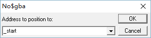
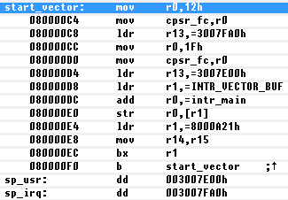
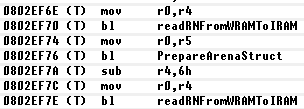
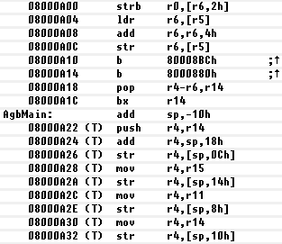
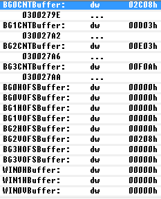

# Synchronize info in IDA database to no$gba debugger.

Share IDA knowledge with NO$GBA and make debugging much easier.

# For example:

## Jump to label directly

## Display called/jumped label

## Auto ARM/Thumb recognization

## Auto Code/Data recognization

# Installation

Copy. idc file into plugins folder in your IDA directory.

# Usage

Menu: Edit -> Plugins -> Sync to NO$GBA debugger
Hotkey: Alt + 9
Besides, it will synchronize automatically when closing IDA database.
